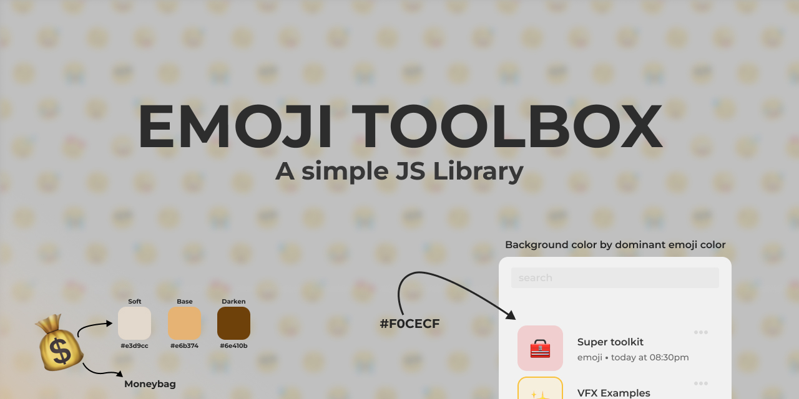

# 🧰 Emoji Toolbox ~ 😁✅🎉
Want to add a touch of color to your application or website with emojis? Emoji Toolbox is the tool you need! This library allows you to extract the **dominant color of any emoji** and use it as background color or any other purpose.

## Installation
To install Emoji Toolbox, run the following command in your terminal:

npm or yarn
```bash
npm install emoji-toolbox

yarn add emoji-toolbox
```
Once you have it installed, you can use it in your code like this:

#### API

```js
import emoji from 'emoji-toolbox';

emoji.identifier("✅"); // Returns the identifier of the emoji: white_check_mark
emoji.humanName("✅"); // Returns the identifier in human readable: White Check Mark
emoji.unicode("✅"); // Unicode value: U+2705
emoji.normalColor("✅", "rgb"); // Defaults return RGB value by default
emoji.softColor("✅", "hex"); // Hexadecimal explit
emoji.darkenColor("✅", "both"); // object of rgb and hex values

emoji.hasEmoji("Detect if this phrase contains a emoji 🧰"); // True
emoji.demojify("Remove emoji from phrase 🗯️"); // Remove emoji from phrase

```

This code creates a new instance of the Emoji class with the "🧽" emoji as an argument. You can then access the various properties and methods of this instance to get different pieces of data about the emoji.

For example, the emojiData property contains all the data for the emoji, including its name, Unicode, and various color styles. The name() and unicode() methods return the name and Unicode of the emoji, respectively. The normalColor() method returns the base color style of the emoji, and its hexadecimal and rgb properties contain the color in hexadecimal and RGB formats, respectively.

## License
Emoji Toolbox is available under the Apache-2.0 License.
